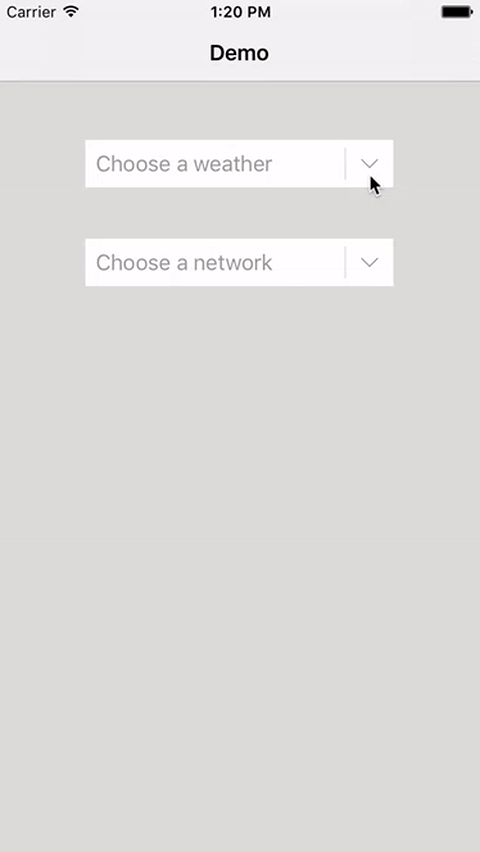
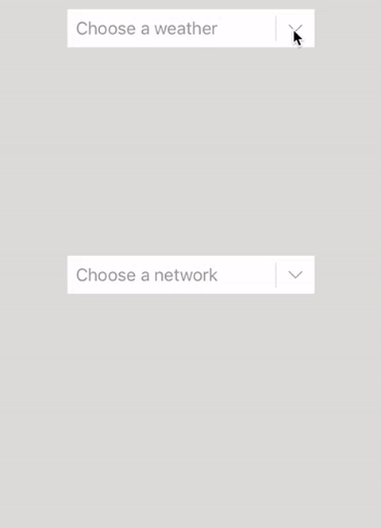
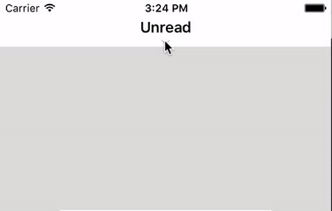

## CCDropDownMenu

[](https://github.com/Cokile/CCActivityIndicatorView/blob/master/Licence)
[](https://github.com/Cokile/CCDropDownMenu/releases)
[](https://img.shields.io/cocoapods/v/CCDropDownMenus.svg)
[](https://github.com/Carthage/Carthage)

`CCDropDownMenu` now features

|                   Type                   |
| :--------------------------------------: |
| [ManaDropDownMenu](https://github.com/Cokile/CCDropDownMenu#manadropdownmenu) |
| [GaiDropDownMenu](https://github.com/Cokile/CCDropDownMenu#gaidropdownmenu) |
| [SyuDropDownMenu](https://github.com/Cokile/CCDropDownMenu#syudropdownmenu) |


## Installation

### Cocoapods

```ruby
pod 'CCDropDownMenus'
```

### Carthage

```ruby
github "Cokile/CCDropDownMenu"
```

### Manually 

Add all the files in the `CCDropDownMenu` folder to your project.


## ManaDropDownMenu



### Easy to use

```objective-c
#import <CCDropDownMenus/CCDropDownMenus.h>

// ...
@interface ViewController () <CCDropDownMenuDelegate>

// ...
- (void)viewDidLoad {
	// ...
    ManaDropDownMenu *menu = [[ManaDropDownMenu alloc] initWithFrame:<#CGRect#> title:<#NSString#>];
	menu.delegate = self;
    menu.numberOfRows = <#NSInteger#>;
    menu.textOfRows = @[<#NSString#>, <#NSString#>, <#NSString#>, ...];
  	[self.view addSubview:menu];
}

- (void)dropDownMenu:(CCDropDownMenu *)dropDownMenu didSelectRowAtIndex:(NSInteger)index {
  	// ...
}
```

### Customisable

```objective-c
// The color that applys to the title and the arrow when the drop down menu is expanded. Default value is a orange color.
menu.activeColor = <#UIColor#>;

// The color that applys to the title and the arrow when the drop down menu is closed. Default value is a gray color.
menu.inactiveColor = <#UIColor#>;

// The color that applys to the seperator for the title and the indicator. Default value is a gray color.
menu.seperatorColor = <#UIColor#>;

// The color that applys to the title view. Default value is a white color.
menu.titleViewColor = <#UIColor#>;

// The string that applys to the title for the drop down menu.
menu.title = <#NSString#>;

// The image that applys to the right indicator for the drop down menu. Default value is a arrow image.
menu.indicator = <#UIImage#>;

// The value that applys to the gutter distance between list view. Default value is 0.
menu.gutter = <#CGFloat#>;

// The boolean value that indicates the weahter apply a resilient when expansion. Default value is NO.
// Getter is isResilient
menu.resilient = <#BOOL#>;

// The value that applys to the height for row of the drop down menu.
menu.heightOfRows = <#CGFloat#>;
  	
// The strings that represent the name of the image for each row.
menu.imageNameOfRows = @[<#NSString#>, @<#NSString#>, <#NSString#>, ...];
  
// The colors that applys to background color for each row.   
menu.colorOfRows = @[<#UIColor#>, <#UIColor#>, <#UIColor#>, ...];
```


## GaiDropDownMenu



### Easy to use

```objective-c
#import <CCDropDownMenus/CCDropDownMenus.h>

// ...
@interface ViewController () <CCDropDownMenuDelegate>

// ...
- (void)viewDidLoad {
	// ...
    GaiDropDownMenu *menu = [[GaiDropDownMenu alloc] initWithFrame:<#CGRect#> title:<#NSString#>];
	menu.delegate = self;
    menu.numberOfRows = <#NSInteger#>;
    menu.textOfRows = @[<#NSString#>, <#NSString#>, <#NSString#>, ...];
  	[self.view addSubview:menu];
}

- (void)dropDownMenu:(CCDropDownMenu *)dropDownMenu didSelectRowAtIndex:(NSInteger)index {
  	// ...
}
```

### Customisable

```objective-c
// The color that applys to the title and the arrow when the drop down menu is expanded. Default value is a orange color.
menu.activeColor = <#UIColor#>;

// The color that applys to the title and the arrow when the drop down menu is closed. Default value is a gray color.
menu.inactiveColor = <#UIColor#>;

// The color that applys to the seperator for the title and the indicator. Default value is a gray color.
menu.seperatorColor = <#UIColor#>;

// The color that applys to the title view. Default value is a white color.
menu.titleViewColor = <#UIColor#>;

// The string that applys to the title for the drop down menu.
menu.title = <#NSString#>;

// The image that applys to the right indicator for the drop down menu. Default value is a arrow image.
menu.indicator = <#UIImage#>;

// The value that applys to the gutter distance between list view. Default value is 0.
menu.gutter = <#CGFloat#>;

// The boolean value that indicates the weahter apply a resilient when expansion. Default value is NO.
// Getter is isResilient
menu.resilient = <#BOOL#>;

// The boolean value that indicates that whether the rows show from the same side when expansion. Default value is NO.
// Getter is doesAppearFromOneSide
menu.appearFromOneSide = <#BOOL#>;

// The value that applys to the height for row of the drop down menu.
menu.heightOfRows = <#CGFloat#>;
  	
// The strings that represent the name of the image for each row.
menu.imageNameOfRows = @[<#NSString#>, @<#NSString#>, <#NSString#>, ...];
  
// The colors that applys to background color for each row.   
menu.colorOfRows = @[<#UIColor#>, <#UIColor#>, <#UIColor#>, ...];
```


## SyuDropDownMenu



### Easy to use

```objective-c
#import <CCDropDownMenus/CCDropDownMenus.h>

// ...
@interface ViewController () <CCDropDownMenuDelegate>

// ...
- (void)viewDidLoad {
	// ...
  	// You should set the batTintColor of the navigation first.
    // If the view controller is embeded into a UINavigationController, you should pass YES to the second parameter, otherwise pass NO.
    SyuDropDownMenu *menu = [[SyuDropDownMenu alloc] initWithNavigationBar:<#UINavigationBar#> useNavigationController:<#BOOL#>;
	menu.delegate = self;
    menu.numberOfRows = <#NSInteger#>;
    menu.textOfRows = @[<#NSString#>, <#NSString#>, <#NSString#>, ...];
  	[self.view addSubview:menu];
}

- (void)dropDownMenu:(CCDropDownMenu *)dropDownMenu didSelectRowAtIndex:(NSInteger)index {
  	// ...
}
```

### Customisable

```objective-c
// The color that applys to the title and the arrow when the drop down menu is expanded. Default value is a light blue color.
menu.activeColor = <#UIColor#>;

// The color that applys to the title and the arrow when the drop down menu is closed. Default value is a gray color.
menu.inactiveColor = <#UIColor#>;

// The color that applys to the title view. Default value is the bar tint color of the navigation bar.
menu.titleViewColor = <#UIColor#>;

// The image that applys to the right indicator for the drop down menu. Default value is a arrow image.
menu.indicator = <#UIImage#>;

// The value that applys to the gutter distance between list view. Default value is 0.
menu.gutter = <#CGFloat#>;

// The boolean value that indicates the weahter apply a resilient when expansion. Default value is NO.
// Getter is isResilient
menu.resilient = <#BOOL#>;

// The value that applys to the height for row of the drop down menu.
menu.heightOfRows = <#CGFloat#>;
  
// The colors that applys to background color for each row.   
menu.colorOfRows = @[<#UIColor#>, <#UIColor#>, <#UIColor#>, ...];
```


## Requirement

CCDropDownMenu requires ARC.


## TODO

- More types of drop down menu.
- Performance improvement


Any Pull Requests and issues are welcome. 
